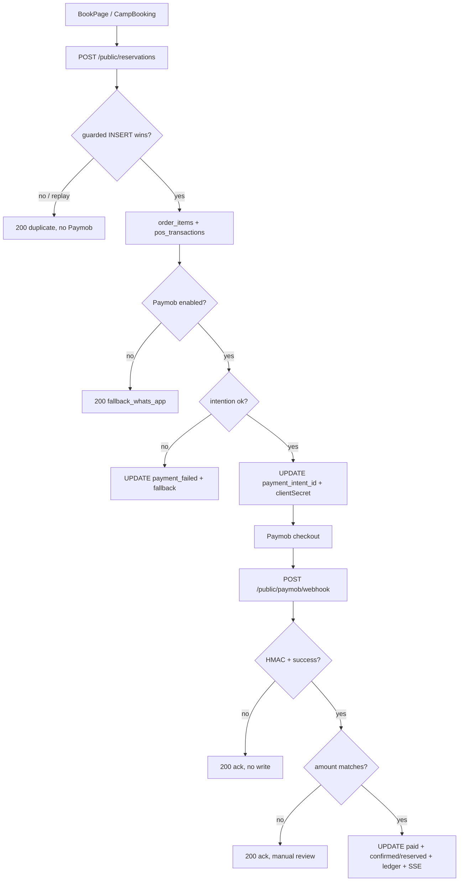

# Pass 3 — Flow Audit F1–F8 (read-only, no D1 writes)

- Date: 2026-09-24
- Repo: /home/michael/devin/opencode-workspace/sinaicamps
- Mode: READ-ONLY. No source modified, no D1 writes, no deploy.
- Spec: `.opencode/agents/tmp/2026-09-24-pass3-flows.md`
- Surface base: `.opencode/audits/full-audit-2026-09-24/01-surface.md`
- Each flow is a numbered step list: step # | what happens | endpoint/file | DB write | failure handling.
- Flags carry `file:line` + one falsification attempt. Anything not falsified is in UNVERIFIED.

---

## F1 — Guest books room (public form → reservation → Paymob → webhook → admin view)

| # | What happens | Endpoint / file | DB write | Failure handling |
|---|---|---|---|---|
| 1 | Guest opens marketplace deep link; SSR fetches tenant | `GET /camp/:id/book` `app/src/pages/camp/[id]/book.astro:6-24` → `BookPage.astro` + `TenantLanding.astro:10,202` `CampBooking.tsx:96` | none (read) | `forbidden \|\| !tenant → <ZoneGuard/>` 404; `try/catch` logs, tenant stays null |
| 2 | Guest picks room/dates; price preview | `GET /api/orders/calculate-price?roomId&checkIn&checkOut` `backend/src/api/orders.js:347-359` → `calculatePriceOnServer:274-338` | none | 400 missing params; unknown room/product returns `total_price:0` success (not 404) |
| 3 | Availability check (advisory) | `GET /api/availability` `backend/src/api/orders.js:1365-1427` | none | 400 missing dates; 500 `Failed to check availability`; empty → `{availability:[]}` |
| 4 | Submit reservation (idempotent) | `POST /api/public/reservations` `backend/src/api/reservations.js:220` via `createPublicReservation` `app/src/lib/api.ts:919`; UI `ReservationSummary.tsx:253-262` sends `roomId/checkInDate/checkOutDate/guestName/idempotencyKey/items` | — | zod 400; 404 tenant/room; 400 capacity/dates; 409 overlap |
| 5 | Tenant resolve + room ownership + date guards | `reservations.js:233-263` | none | 404 `Tenant not found` / `Room not found`; 400 past dates / checkOut≤checkIn |
| 6 | Advisory overlap SELECT | `reservations.js:266-274` `SELECT orders WHERE overlap AND order_state_id!='cancelled'` | none | 409 `Room is not available` (advisory only; guard below is authoritative) |
| 7 | Server pricing (room + meal plans) | `reservations.js:280-300` via `calculatePriceOnServer:153-214` + `pos_products` lookup `289-293` | none | unknown room/rate → price 0 (order still created at 0); unknown meal product `continue` (silently skipped) |
| 8 | Find-or-create customer | `reservations.js:303` → `findOrCreateCustomer:109-151` | `SELECT customers` by email/phone; `UPDATE customers COALESCE` `:126-128,:139-142`; or `INSERT customers` `:147-149` | no error branch — duplicate email+phone race can INSERT twice (no UNIQUE guard cited) |
| 9 | Idempotency replay pre-check | `reservations.js:319-331` `SELECT orders WHERE tenant_id+reference` | none | hit → 200 `duplicate:true` envelope `buildDuplicateResponse:87-107` (never re-runs Paymob) |
| 10 | Guarded order INSERT | `reservations.js:333-357` `INSERT INTO orders … SELECT … WHERE NOT EXISTS (overlap OR reference)`; `batch:357` | `INSERT orders (pending/awaiting_payment)` | `changes===0` → re-SELECT reference `:362-364`; hit → duplicate 200; else 409 `Room no longer available` |
| 11 | Meal-plan line items + mirror POS txns | `reservations.js:380-430` (only after INSERT wins) | `INSERT order_items (meal_plan)` `:403-410`; `INSERT pos_transactions … 'MP-'+reference` `:413-424` | unknown product skipped; two separate `batch()` calls `:428-429` — second can fail after first committed (see FLAG F1-3) |
| 12 | Load Paymob config | `reservations.js:433` → `loadPaymentConfig` `backend/src/services/paymentConfig.js:24-63` (platform_settings blob → env fallback, never throws) | `SELECT payment FROM platform_settings WHERE id=1` (read) | disabled/missing → 200 `paymob_enabled:false, fallback_whats_app:true` `:435-449` (order kept) |
| 13 | Create Paymob intention | `reservations.js:456-478` → `createPaymobIntention` `backend/src/services/paymob.js:20-65` (embeds `orderRef:<ref>` in item description `:38`) | none (HTTP to Paymob) | `catch → UPDATE orders payment_status='payment_failed' :481-483` + 200 fallback envelope `:485-497` |
| 14 | Persist intention id | `reservations.js:501-503` `UPDATE orders SET payment_intent_id` | `UPDATE orders` | no catch — throw → 500 `Failed to create reservation` `:519` after order+items already committed |
| 15 | Redirect to Paymob Unified Checkout | `ReservationSummary.tsx:264-268` `window.location.href=https://accept.paymob.com/unifiedcheckout/?publicKey&clientSecret` | none | no clientSecret/publicKey → `setPayError(paymentUnavailable)` + `submitLead()` fallback `:270-273` |
| 16 | Paymob retries → webhook | `POST /api/public/paymob/webhook` `backend/src/api/paymob-webhook.js:162` (index.js:734, HMAC only, no JWT) | — | `text()` fail → 400; empty → 400; disabled/no secret → 503 `:176-187`; bad HMAC → 401 `:198-203` |
| 17 | Parse + gate terminal success | `paymob-webhook.js:192-208` via `extractPaymobTransaction` `paymob.js:166-189` | none | `success!==true \|\| pending===true` → 200 `{received:true}` (ack, no write) |
| 18 | Resolve orderRef from items/name/merchant_order_id | `paymob-webhook.js:215` → `extractOrderReference:85-106` regex `/orderRef:([A-Za-z0-9_-]+)/` | none | null → 200 ack + log, no write `:217-222` |
| 19 | Booking branch: amount/currency gate | `paymob-webhook.js:228-249` `SELECT orders WHERE reference` + `amountMatchesOrder:122-135` | none (read) | mismatch → 200 ack, NEVER touches order/ledger `:242-249` (fail-closed, manual review only) |
| 20 | Money write + state transition | `paymob-webhook.js:252-263` `UPDATE orders SET payment_status='paid', paymob_transaction_id, amount_paid=total_amount` + `applyPaidStateTransition:18-36` (`pending→confirmed` guarded + `rooms_new room_status='reserved'`) | `UPDATE orders`; `UPDATE rooms_new` | transition is `WHERE order_state_id='pending'` idempotent; non-pending orders keep paid money write but skip room flip |
| 21 | SSE broadcast (best-effort) | `paymob-webhook.js:266` → `broadcastNewBooking:49-71` (also `orders.js:85-107` on admin create) | none (DO fetch, `.catch(()=>{})`) | never fails webhook |
| 22 | Ledger capture (best-effort idempotent) | `paymob-webhook.js:274-285` `INSERT INTO marketplace_payments … SELECT … WHERE NOT EXISTS (order_reference)` | `INSERT marketplace_payments (captured)` | `try/catch` logs only `:286-288`, never blocks ack |
| 23 | Storefront branch (same webhook) | `paymob-webhook.js:297-352` | `UPDATE storefront_orders paid`; `INSERT marketplace_payments (storefront)` idempotent | same amount gate + best-effort ledger |
| 24 | No-match ack | `paymob-webhook.js:354-366` | none | 200 `{received:true}`; `catch → 500` `:358-363` (Paymob will retry) |
| 25 | Public status lookup | `GET /api/orders/status/:ref?email=` `orders.js:362-398` | none | 400 email required; 404 on miss OR email mismatch (indistinguishable) |
| 26 | Admin view | `GET /api/orders` `orders.js:618-655`, `GET /:id` `:678-696`, `GET /inbox` `inbox.js:95-139` (booking arm), `GET /api/stream/orders` SSE `index.js:441` | none | 401/404 per route; SSE gate `requireAuth realm admin tokenTypes:[stream]` |

F1 flags:
- **F1-1 `backend/src/api/reservations.js:501-503` — intention-id UPDATE outside any batch; throw after commit leaves order+items with no intention.** Falsification: read `try{…}catch(e){return errorResponse('Failed to create reservation')}:518-520` wraps steps 10-14; steps 10 (`batch:357`) and 11 (`batch:428-429`) already committed before step 14, no compensation. No retry-intention endpoint found (`grep intention` shows only create + webhook persist).
- **F1-2 `backend/src/api/reservations.js:477` `redirectionUrl: ${origin}/booking/${reference}/confirmation` — target page does not exist.** Falsification: `grep confirmation app/src/pages` returns only `storefront/order/[orderNumber]/confirmation.astro`; no `booking/` route file exists.
- **F1-3 `backend/src/api/reservations.js:428-429` — order_items batch and pos_transactions batch are separate; second failure orphans items without POS mirror (or vice versa).** Falsification: two sequential `await c.env.DB.batch()` with no shared transaction; D1 batch is per-call atomic only.
- **F1-4 `backend/src/api/reservations.js:419` hardcodes `store_id=1` for meal-plan mirror txns while POS resolves the real store (`routes/pos/index.js:624-629`).** Falsification: read both; reservation path has no store lookup, only `organization_id` via `tenant_org_mapping:389-392`. FK failure mode unverified → see UNVERIFIED-U1.

---

## F2 — Storefront cart → checkout → Paymob/WhatsApp → admin

| # | What happens | Endpoint / file | DB write | Failure handling |
|---|---|---|---|---|
| 1 | Browse catalog | `GET /api/storefront/products` `backend/src/api/storefront.js:105-136` (public projection `PUBLIC_PRODUCT_COLUMNS:77-97`, no cost_price) | none | 400 tenant required; paginated envelope |
| 2 | Open/create cart | `GET /api/storefront/cart?sessionId` `:153-182`; `POST /cart/items` `:184-235` via `StorefrontCheckout.tsx:40-44` + `getStorefrontCart/checkoutStorefront` `app/src/lib/api.ts:2010` | `INSERT carts:205-208` on first add; `INSERT cart_items:227-229` or `UPDATE quantity:220-222` | 404 product; 400 sessionId required; `console.log [storefront] cart.add :232` advisory only |
| 3 | Edit cart | `PUT /cart/items/:id` `:237-259`; `DELETE /cart/items/:id` `:261-274` | `UPDATE cart_items`; `DELETE cart_items` | 404 tenant-scoped item check `:246-249,:267-270` |
| 4 | Checkout | `POST /api/storefront/checkout` `:278-423` (`sessionId/customerEmail/customerPhone/shippingAddress`) | — | 400 tenant/session; 404 cart; 400 empty cart `:301` |
| 5 | Snapshot cart → order atomically | `:292-334` `SELECT cart_items + pos_products name` then single `batch([INSERT storefront_orders pending, INSERT storefront_order_items×N, DELETE cart_items])` | `INSERT storefront_orders (pending/pending)`; `INSERT storefront_order_items`; `DELETE cart_items` | batch atomic — order never exists without items, cart never orphaned (comment `:308-311`) |
| 6 | Paymob disabled path | `:344-359` `loadPaymentConfig` | none | 201 `paymobEnabled:false, fallbackWhatsapp:true`, order stays `pending` |
| 7 | Paymob intention | `:366-388` (same `createPaymobIntention`, `redirectionUrl /storefront/order/<no>/confirmation` which EXISTS `:387`) | none (HTTP) | `catch → 201 paymentStatus:'payment_failed' :389-403` **without persisting** (see FLAG F2-1) |
| 8 | Persist intention | `:406-408` `UPDATE storefront_orders SET payment_intent_id` | `UPDATE storefront_orders` | throw → 500 after order committed (same shape as F1-1) |
| 9 | Pay / fallback UI | `StorefrontCheckout.tsx:104-161` iframe (`paymobToken` via `fetch accept.paymob.com/api/auth/tokens :54-61`) or WhatsApp `wa.me` link `:140-144`; link to `/storefront/order/<no>/confirmation :154-159` | none | token fail → silent fallback comment `:62-64`; no phone → `contact the host directly :149` |
| 10 | Confirmation page | `storefront/order/[orderNumber]/confirmation.astro:1-63` + `StorefrontConfirmation.tsx:2` (tenant-only ZoneGuard) | reads via `getStorefrontOrders?sessionId` (`storefront.js:427-448`) | `forbidden \|\| !tenant → ZoneGuard`; session must be retained (comment `StorefrontCheckout.tsx:82-84`) |
| 11 | Webhook settle | `paymob-webhook.js:297-352` (see F1-19/23) | `UPDATE storefront_orders paid`; `INSERT marketplace_payments` | amount gate; best-effort ledger |
| 12 | Admin overview | `GET /api/storefront/admin/carts :783-798`, `GET /admin/orders :800-809`, `GET /orders?sessionId :427-448` | none | — (see FLAG F2-2) |

F2 flags:
- **F2-1 `backend/src/api/storefront.js:389-403` — Paymob-failure `paymentStatus:'payment_failed'` lives only in the JSON response; `storefront_orders.payment_status` stays `pending`.** Falsification: the `catch` block returns directly with no `UPDATE`; contrast reservation path which persists `payment_failed` (`reservations.js:481-483`). A later `GET /orders` still shows `pending`.
- **F2-2 `backend/src/api/storefront.js:800-809` `GET /admin/orders` selects `FROM orders` (booking table), not `storefront_orders`.** Falsification: read SQL `SELECT * FROM orders WHERE tenant_id` under the storefront admin section; storefront orders are invisible there (must use `GET /storefront/orders?sessionId` or webhook ledger).

---

## F3 — POS sale (shift → products → promo → tender → order → stock → receipt → close → variance)

| # | What happens | Endpoint / file | DB write | Failure handling |
|---|---|---|---|---|
| 1 | Cashier login | `POST /api/auth/pos-login` → `handlePosLoginRequest` `backend/src/routes/pos/index.js:104-181` (index.js:210) | `UPDATE pos_users last_login_at :158-160` | 400 id/pw; 401 no user/bad pw; 403 deactivated; `rehashIfNeeded :134` best-effort |
| 2 | Refresh | `POST /api/pos/auth/refresh` `:212-294` (`posRefreshGate` realm pos tokenTypes refresh) | none | 401 missing/type/realm mismatch; 401 unknown user |
| 3 | Auth gate for all below | `posAuth :73-99` (Bearer pos access only, `is_active AND deleted_at IS NULL` per call) | none | 401 no header / bad type / revoked |
| 4 | Open shift | `POST /api/pos/shifts/open` `:1036-1069` | `INSERT pos_shifts (open)` `:1057-1060` | 400 negative cash / existing open shift `:1052-1054`; 500 |
| 5 | Check active shift | `GET /api/pos/shifts/active` `:1013-1033` | none | `{active:false}` when none |
| 6 | Load products | `GET /api/pos/products` `:299-317` (tenant dimension `posUser.tenantId`) | none | 500 |
| 7 | Preview promo | `POST /api/promotions/apply` `backend/src/api/promotions.js:244-339` (best-per-item, UTC day/window/min_purchase) | none | 400 schema/business rules (`businessRuleErrors:75-87`); 500 |
| 8 | Tender sale | `POST /api/pos/orders` `:320-836` schema `:20-35` (items ≤100, cash\|card\|split, tableId, tip) | — | zod 400; product/quantity/price 400 `:406-416` |
| 9 | Idempotency replay | `:338-387` `SELECT pos_transactions WHERE idempotency_key+tenant+cashier` + items | none | hit → 200 `deduplicated:true` without re-charging stock |
| 10 | Promo apply (inline duplicate of /apply) | `:438-505` best promo per item, discount before tax | none | `try/catch → swallow` `:503-505` — order proceeds at full price with no signal (FLAG F3-2) |
| 11 | Table + tax + split validation | `:510-552` table ownership `SELECT pos_tables :511-513`; org tax `SELECT pos_organizations :522-524` default 0.1; split legs sum ±0.01 | none | 400 table/split; tax lookup fail → silent default |
| 12 | Stock pre-check (2 queries) | `:559-606` bulk recipe ingredients + bulk ingredient stock, accumulate shared ingredients | none | 400 `Insufficient stock for ingredient … (Need/Have)` `:598-600`; missing ingredient row skipped (`continue :595`) |
| 13 | Atomic commit batch | `:637-710` conditional stock `UPDATE … WHERE stock>=deduct :645-649` + `INSERT pos_transactions (completed/completed, kitchen pending) :654-672` + `UPDATE pos_tables occupied :679-683` + `INSERT pos_transaction_items :687-694` + `INSERT order_discounts :699-710` | `UPDATE pos_products` (self + ingredients); `INSERT pos_transactions/items/discounts`; `UPDATE pos_tables` | `UNIQUE(idempotency)` → reload existing `:715-721`; conditional deduction `changes===0` → compensate path next |
| 14 | Race compensation | `:729-760` detect shorted deduction index, `+stock` back applied rows, `DELETE items + transactions` | `UPDATE pos_products +N`; `DELETE pos_transaction_items/transactions` | returns 400 retry; compensate `batch().catch(()=>{}) :753` swallows (FLAG F3-1) |
| 15 | Low-stock alerts best-effort | `:766-799` `SELECT stock vs min_stock_level`, `INSERT INTO inbox … lowstock_…` | `INSERT inbox` | nested `try/catch` + `.catch(()=>{})` — never fails order |
| 16 | Receipt | response `order{orderNumber/subtotal/discount/tax/total/legs/appliedPromotions/items} :801-831`; reads `GET /pos/orders :839-868`, `GET /pos/orders/:id :871-899`; hooks `usePosQueries.ts` (`usePosOrders`, `useCreateTableMutation`, `useUpdateKitchenStatusMutation`) | none | paginated envelope; `?raw=1` legacy array |
| 17 | Close shift + variance | `POST /api/pos/shifts/close` `:1072-1134` `SUM(amount_cash) WHERE created_at>=opening_time AND status!='voided' :1096-1101`, `expected=opening+cash`, `discrepancy=actual-expected :1104` | `UPDATE pos_shifts closed/expected/actual (guarded AND status='open') :1108-1113` | 400 no amount/active shift; 409 already closed `:1115-1117` (race-safe) |
| 18 | Dashboard | `GET /api/pos/dashboard` `:902-1010` (org-timezone day window or UTC fallback) | none | 500; empty → zeros |

F3 flags:
- **F3-1 `backend/src/routes/pos/index.js:752-753` — compensation `await batch(compensate).catch(()=>{})` swallows its own failure, leaving the orphan order the compensation was meant to delete.** Falsification: read shows no retry/rethrow; the preceding `DELETE` statements are the only orphan cleanup. Contrast normal batch `await env.DB.batch(statements)` without catch (`:713`) which does propagate.
- **F3-2 `backend/src/routes/pos/index.js:503-505` — promo lookup failure is silent; sale commits at full price with `appliedPromotions:[]` and no warning.** Falsification: `catch {}` with comment `never fail the order`; response shape `:818-821` gives no `promoError` field, so terminal cannot distinguish "no promo" from "promo system down".

---

## F4 — Admin record-payment (modal → record-payment → payment_records → amount_paid → status → audit)

| # | What happens | Endpoint / file | DB write | Failure handling |
|---|---|---|---|---|
| 1 | Open modal from order / cash desk | `RecordPaymentModal.tsx:41` (`OrdersPanel.tsx:318`, `CashDeskPanel.tsx:244`); prior payments `useOrderPaymentsQuery(open&&!receipt) :56` → `GET /orders/:id/payments` `orders.js:1181-1197` (bare array, tenant-scoped 404) | none | `if(!open) return null :122`; closed during pending is blocked `:80` |
| 2 | Client guard | `validateRecordPayment` `app/src/lib/cashdesk.ts:98-100`; balance `orderBalance`; modal disables submit `:142`, shows `clientError :220-224` | none | overpay/split-mismatch blocked pre-flight; server 400 still surfaced `:225-229` |
| 3 | Submit | `useRecordPaymentMutation` `app/src/hooks/useQueryHooks.ts:757-763` → `recordPayment` `app/src/lib/api.ts:418-420` `POST /api/orders/:id/record-payment` | — | — |
| 4 | Validate + resolve legs | `orders.js:1220-1251` schema `recordPaymentSchema:70-79` (cash\|card\|split, legs ±0.01) | none | 401 no tenant; 422 zod; 400 split legs missing/mismatch |
| 5 | Load order | `:1254-1257` `SELECT id/total/paid/status WHERE tenant+id` | none | 404 |
| 6 | Overpay guard | `:1264-1269` `(paidSoFar+amount > total+0.01)` | none | 400 with paid/amount/total figures |
| 7 | Idempotency | `:1273-1280` `SELECT payment_records WHERE tenant+id(key)` | none | hit → 200 `deduplicated:true` |
| 8 | Insert ledger row | `:1287-1295` `INSERT INTO payment_records (id/tenant/order/amount/method/legs/received_by/approved_by/reference/notes)` | `INSERT payment_records` | throw → 500 `Failed to record payment` (no order mutation yet — safe) |
| 9 | Flip order totals | `:1297-1303` `newPaid=round(paid+amount)`, `isFull=newPaid+0.01>=total`, `UPDATE orders SET amount_paid/payment_status/payment_method` (partial keeps old status; full → `paid`) | `UPDATE orders` | **NOT in the same batch as step 8** (FLAG F4-1); `order_state_id`/room untouched by design `:1214-1215` |
| 10 | Audit (best-effort) | `:1308-1327` → `logAudit` `backend/src/api/audit.js:75-93` (swallows, returns null) | `INSERT audit_log (create/order)` | never breaks response; read via `GET /api/audit` `audit.js:98-155` |
| 11 | Receipt | response `payment + order{id/total/paid/balance/status} :1329-1352` → `PaymentReceipt` (`RecordPaymentModal.tsx:124-133`, merges `priorPayments+resp.payment :100-103`) | none | — |

F4 flags:
- **F4-1 `backend/src/api/orders.js:1287-1303` — ledger INSERT and order UPDATE are sequential `.run()` calls, not one `batch()`.** Falsification: read shows `await …INSERT…run()` then `await …UPDATE…run()` with no batch; a Worker crash/isolate eviction between them leaves `payment_records` without the `amount_paid` flip (balance derived `total−paid` then disagrees with ledger sum). Contrast `PATCH /:id/status` which batches order+room (`orders.js:502-531`).
- **F4-2 `backend/src/api/audit.js:88-92` — audit failures only `console.error`, no retry/dead-letter.** Falsification: `logAudit` catches and returns null; caller comment (`orders.js:1305-1307`) confirms best-effort by design. A lost audit row is undetectable (no `GET /audit` gap signal).

---

## F5 — Tenant onboarding (signup → token → wizard → tenant → project → admin → room → rate plan → booking)

| # | What happens | Endpoint / file | DB write | Failure handling |
|---|---|---|---|---|
| 1 | Signup (public) | `POST /api/public/signup` `backend/src/api/onboarding.js:56-144` schema `:17-25` | — | zod 400; 400 subdomain format/uniqueness `:66-76`; 400 email exists `:79-84` |
| 2 | Atomic provision | `:98-128` single `batch([INSERT tenants pending_setup, INSERT admins is_active=0, INSERT pos_organizations, INSERT pos_stores (subquery org), INSERT tenant_org_mapping (subquery org)])` | `INSERT tenants/admins/pos_organizations/pos_stores/tenant_org_mapping` | any failure rolls back all (comment `:94-95`); `catch → 500 Signup failed :136-143` |
| 3 | Token status poll | `GET /api/onboarding/status/:token` `:148-184` | none | 404 invalid link; `{setup_complete: onboarding_status==='completed'}` |
| 4 | Wizard partial saves | `POST /api/onboarding/tenant` `:265-312` whitelist `tenantUpdateSchema:31-38` | `UPDATE tenants SET <whitelist>` | 400 token required; 404; strips unknown keys (`.strip()`) |
| 5 | Wizard complete | `POST /api/onboarding/setup` `:188-261` schema `:41-50` | — | 404 token; 400 already completed `:207-209` |
| 6 | Profile update | `:221-227` dynamic `UPDATE tenants` | `UPDATE tenants` | sequential, not batched (FLAG F5-2) |
| 7 | Activate | `:231-245` `UPDATE tenants (completed/active/token=NULL)` + `UPDATE admins is_active=1` + `UPDATE admins auto_login_token/expires` | `UPDATE tenants`; `UPDATE admins ×2` | same; token cleared so no reuse (comment `:229-230`); login gated `is_active=1` (`onboarding.js:106-108`) |
| 8 | Super-admin create (alt path) | `POST /api/tenants` `backend/src/api/tenants.js:174-250` (super-admin only `:176-178`) | `INSERT tenants active :213-225` then `INSERT admins active=1 :234-244` | **two separate `.run()`** (FLAG F5-1); 400 subdomain/domain clash; 400 admin_password required `:229-231` |
| 9 | Branding edit | `PUT/PATCH /api/me` `tenants.js:279-354` | `UPDATE tenants COALESCE`; optional `UPDATE admins` | 400 no tenant; silent no-op when no fields |
| 10 | Bulk import (alt path) | `POST /api/tenants/import` `tenant-import.js` (manifest: branding+products+rooms+ratePlans+menu+POS users) | `INSERT pos_products :259`, `INSERT rooms_new :314`, `INSERT rate_plans_new :352`, `INSERT projects :581` | referenced products must exist (400/404); `pos_users` first/last only (GENERATED name); base64→R2, no KV writes |
| 11 | Project/camp | `POST /api/projects` `backend/src/api/camps.js:273-331` | `INSERT projects :307-320` (+ best-effort `project_meta notes :322-325`) | 400 dates/slug; 409 slug clash `:300-305` |
| 12 | Room | `POST /api/rooms` `camps.js:754-795` | `INSERT rooms_new SELECT … WHERE camp+product owned :781-787` (+ mirror `products` via `ensureProductInProductsTable:778`) | 400 duplicate name; 404 camp/product not owned (`changes===0 :788-790`) |
| 13 | Rate plan | `POST /api/rateplans` `camps.js:959-995` | `INSERT rate_plans_new SELECT … FROM pos_products :974-979` (+ mirror) | 404 product; 409 duplicate id |
| 14 | First booking | `POST /api/orders` `orders.js:698-874` (admin create; guest path is F1) | `INSERT orders` guarded + `INSERT order_items` + `pos_transactions` mirror (see F1-10/11) | 400 validation; 409 race; 400 meal-plan org missing `:791-793` |

F5 flags:
- **F5-1 `backend/src/api/tenants.js:213-244` — super-admin create does `INSERT tenants …run()` then `INSERT admins …run()` with no batch.** Falsification: contrast onboarding signup batch (`onboarding.js:98-128`); a crash between the two leaves an admin-less active tenant that passes the public `status='active'` filter (`tenants.js:109,168`).
- **F5-2 `backend/src/api/onboarding.js:221-245` — setup completion is three sequential UPDATEs (profile, activate+null token, admin activate, auto-login token), not one batch.** Falsification: read shows four `await …run()` calls; a crash after tenant-activate but before `admins is_active=1` leaves a live tenant whose admin cannot log in (inverse: token cleared but admin still inactive).

---

## F6 — Service booking (catalog → slot → booking → assignment → transitions → review)

| # | What happens | Endpoint / file | DB write | Failure handling |
|---|---|---|---|---|
| 1 | Define service | `POST /api/services/definitions` `backend/src/api/services.js:90-109` schema `:28-34` | `INSERT service_definitions` | 400 zod; 409 slug UNIQUE `:106` |
| 2 | Add bookable item | `POST /api/services/items` `:157-175` schema `:38-46` | `INSERT service_items` | 404 definition not owned `:167-168` |
| 3 | Publish catalog (public) | `GET /api/services/public/:slug` `:441-487` (tenant by `subdomain + status=active :447-450`, defs `:452-458`, items single `IN()` `:466-476`) | none | 404 tenant |
| 4 | Create availability slot | `POST /api/services/items/:id/availability` `:335-352` | `INSERT service_availability` | 400 missing date/item; 404 item |
| 5 | Read availability | `GET /api/services/items/:id/availability` `:318-332` | none | 404 item; note: slot SELECT filters `service_item_id` only, tenant enforced via item check `:322-324` |
| 6 | Create booking | `POST /api/services/bookings` `:230-266` schema `:50-56` | `INSERT service_bookings (pending)` — guarded `INSERT…SELECT WHERE NOT EXISTS (same item+date, status!='canceled') :247-255` when `scheduled_date`, else plain `INSERT :260-263` | 404 item; 400 item inactive; 409 slot taken `:256-258` |
| 7 | Assign worker | `PATCH /api/services/bookings/:id/assign` `:300-315` | `UPDATE service_bookings assigned_worker_id` | 400 missing id; 404 booking (FLAG F6-1: no worker-existence/status check) |
| 8 | Transition status | `PATCH /api/services/bookings/:id/status` `:269-297` enum `:58-60`, `validTransitions:283-289` | `UPDATE service_bookings status` | 404; 400 illegal transition `:290-292` (terminal `completed/canceled` reject all) |
| 9 | List/filter | `GET /api/services/bookings?status=` `:210-227` | none | 400 tenant |
| 10 | Review | `POST /api/services/reviews` `:385-404`; `GET /bookings/:id/reviews :370-382`, `GET /reviews :407-418` | `INSERT service_reviews` | 400 rating range; 404 item (FLAG F6-2: no completed-booking guard) |
| 11 | Pricing tier | `PUT /api/services/items/:id/pricing` `:421-438` | `UPDATE service_items price_tier/premium` | 400 tier enum; 404 item |

F6 flags:
- **F6-1 `backend/src/api/services.js:300-315` — assign accepts any `assigned_worker_id` with no existence/tenant check and no status guard.** Falsification: handler SELECTs only the booking (`:307-309`), then UPDATEs; contrast item-create which verifies definition ownership (`:165-168`). Can assign to `completed`/`canceled` bookings.
- **F6-2 `backend/src/api/services.js:385-404` — review requires only `service_item_id` + rating; no proof of a completed booking.** Falsification: handler verifies item (`:394-397`) but never reads `service_bookings`; `booking_id` is optional passthrough (`:402`). Fake 5-star reviews need no booking.
- **F6-3 `backend/src/api/services.js:246-264` — `service_availability` slots are never consumed: booking guard checks `service_bookings(same item+date)` equality, not the availability table.** Falsification: no `UPDATE/DELETE service_availability` anywhere in the file (only `POST :335` insert + `DELETE /availability/:id :355` manual delete); double-book prevention and slot inventory are disjoint systems.

---

## F7 — CRM lead (inbox → lead → assign → contact → convert → order lifecycle)

| # | What happens | Endpoint / file | DB write | Failure handling |
|---|---|---|---|---|
| 1 | Public contact submit | `POST /api/leads` + alias `POST /api/contact` `backend/src/api/leads.js:74-101` (index.js:348) schema `:18-35` (email OR phone required) | `INSERT leads (tenant nullable :86-89)` | 422 validation; tenant null when host unresolved (orphan lead, broadcast skipped `:91`) |
| 2 | SSE notify | `broadcastNewLead:46-67` (skips when no tenant) | none (DO fetch best-effort) | never fails response |
| 3 | Unified inbox read | `GET /api/inbox?kind=all\|lead\|booking&status&page` `backend/src/api/inbox.js:95-139` (`LEAD_ARM:31-41` + `BOOKING_ARM:43-60` UNION, unread totals `:123-131`) | none | 400 bad kind; booking status filter maps to `payment_status` while lead maps to `status` (`buildArm:65-82`) — same `?status=` means different things per arm |
| 4 | Mark read | `PATCH /api/inbox/read` `:142-169` schema `:22-25` | lead: `UPDATE leads is_read/read_at :152-154`; booking: `INSERT OR IGNORE inbox_reads :162-164` | 404 lead; booking ack is idempotent even for unknown ids (no 404) |
| 5 | Manage lead | `GET /api/leads :114-146`, `PUT /:id :152-174` enum `new/contacted/converted/archived :38`, `DELETE /:id :177-192` | `UPDATE leads status`; `DELETE leads` | 404 on miss (`changes===0 :166-168,:184-186`); inbox delete `DELETE /inbox/:kind/:id` lead-only, booking → 400 `:172-176` |
| 6 | Create contact | `POST /api/crm/contacts` `backend/src/api/crm.js:158-191` | `INSERT contacts` | 400 zod; 201 |
| 7 | Create CRM lead (assign) | `POST /api/crm/leads` `:260-291` schema `:62-69` (`assignedTo` free text) | `INSERT crm_leads (status new)` | 404 contact not owned `:269-272`; assignee never validated (free-text `assigned_to`) |
| 8 | Move CRM lead | `PATCH /api/crm/leads/:id/status` `:293-312` enum `LEAD_STATUSES:42` | `UPDATE crm_leads` | 404; **no transition guard** — `new→won` direct allowed (contrast `crm_tasks` guard `:449-452`) |
| 9 | Opportunity | `POST /api/crm/opportunities` `:326-355` (`leadId` optional), `PATCH /:id/stage` `:357-376` enum `:43` | `INSERT opportunities`; `UPDATE stage` | no `leadId` existence check (FLAG F7-2); stage has no guard |
| 10 | Convert → order | **No convert endpoint.** `PUT /leads/:id {status:'converted'}` + manual `POST /crm/contacts` + `POST /orders` (F1-10) | three separate writes, no transaction | partial convert leaves `converted` lead with no contact/order (FLAG F7-1); reports count `converted` (`admin-reports.js:163`) regardless |
| 11 | Order lifecycle | `PATCH /orders/:id/status` `orders.js:466-541` (`LEGAL_TRANSITIONS:447-453`), room follow (`ROOM_STATUS_BY_ORDER_STATUS:460-464`), `DELETE /:id :937-961` frees room + `DELETE inbox_reads :955` | `UPDATE orders + rooms_new` (one batch `:502-531`); `DELETE orders` | 409 illegal transition; unknown current state treated terminal |

F7 flags:
- **F7-1 No atomic convert: `leads.js:152-174` status flip, `crm.js:158-191` contact create, and `orders.js:698-874` order create are three independent HTTP calls.** Falsification: `grep convert backend/src/api` returns only the status enum (`leads.js:38`) and a report counter (`admin-reports.js:163`); no handler writes across `leads→contacts→orders` in one batch. Interrupt between calls = `converted` lead with no order (or order with `new` lead).
- **F7-2 `backend/src/api/crm.js:326-355` — `opportunities.lead_id` is never validated.** Falsification: handler destructures `leadId` and INSERTs `leadId||null` with no `SELECT crm_leads`; contrast `POST /crm/leads` which checks contact (`:269-272`). Dangling `lead_id` accepted.
- **F7-3 `backend/src/api/crm.js:293-312` + `:357-376` — lead-status and opportunity-stage PATCHes accept any enum value with no transition machine.** Falsification: read shows direct `UPDATE … SET status/stage` after existence check; only `crm_tasks/:id/status (:433-468)` and `orders/:id/status` enforce transitions.

---

## F8 — Payout (capture → eligible → create → paid → reconcile)

| # | What happens | Endpoint / file | DB write | Failure handling |
|---|---|---|---|---|
| 1 | Capture (from webhook) | `paymob-webhook.js:274-285` (booking) + `:333-343` (storefront) | `INSERT marketplace_payments (captured, channel marketplace, fee/net from pm.marketplaceFeePct)` idempotent `WHERE NOT EXISTS (order_reference)` | ledger `try/catch` never blocks ack `:286-288,:344-346`; amount mismatch → no capture at all (manual review) |
| 2 | List eligible | `GET /api/admin/payouts/eligible?tenantId&limit` `backend/src/api/admin-payouts.js:30-74` `WHERE captured AND payout_id IS NULL AND channel='marketplace' :37` | none | 500; `limit` default 200 caps the batch window; extra `totalNet` field documented `:63-65` |
| 3 | Create payout | `POST /api/admin/payouts` `:78-143` schema `:20-26` (tenantId/paymentIds/method/reference/notes) | `INSERT marketplace_payouts (pending) :123-126` then `Promise.all(UPDATE marketplace_payments SET payout_id) :128-130` | 400 unknown ids / cross-tenant / not-captured / already-batched / non-marketplace `:98-115`; **INSERT then parallel UPDATEs not atomic** (FLAG F8-1) |
| 4 | List / detail | `GET /api/admin/payouts :147-178`, `GET /:id :182-207` (items join `marketplace_payments + tenants + orders` dates) | none | 404 detail; 500 |
| 5 | Mark paid (settle) | `POST /api/admin/payouts/:id/pay` `:211-251` | atomic `batch([UPDATE payouts paid WHERE pending, UPDATE payments settled…]) :233-238` | 404; 409 already settled/cancelled `:221-223` + race guard `changes!==1 → 409 :240-242` |
| 6 | Cancel | `POST /api/admin/payouts/:id/cancel` `:255-291` | atomic `batch([UPDATE payouts cancelled WHERE pending, UPDATE payments payout_id=NULL]) :275-280` | 404; 409 non-pending `:265-267` + race guard `:282-284` |
| 7 | Tenant history (reconcile surface) | `GET /api/financials/payouts` `backend/src/api/financials.js:500-512` (tenant-scoped `payouts + item_count`) | none | 400 tenant; read-only — no settle/reconcile write exists on the tenant side |
| 8 | No scheduler | `backend/wrangler.toml` + `grep scheduled\(` → 0 cron/queues (01-surface §h) | — | payouts never auto-created/settled; fully manual super-admin clicks |

F8 flags:
- **F8-1 `backend/src/api/admin-payouts.js:123-130` — payout header INSERT (single `.run()`) and per-payment `payout_id` UPDATEs (`Promise.all`, parallel `.run()`) are not one batch.** Falsification: read shows no `db.batch()` wrapping both; a crash between them leaves a `pending` payout with zero linked payments (eligible rows stay `payout_id NULL` and can be re-batched into a second payout → double-pay risk is manual-review only). Contrast pay/cancel which ARE single batches (`:233-238,:275-280`).
- **F8-2 No reconcile write: captured-but-never-batched, mismatch-acked (F1-19), and `settled` rows are only observable via list/detail/history endpoints.** Falsification: `grep -rn reconcile backend/src/api` returns no handler; tenant `GET /financials/payouts` is `SELECT` only (`financials.js:500-512`); no cron per 01-surface §h.

---

## Cross-flow flags (unpaired writes / mutated-then-read / interrupts)

- **X-1 Mutated-then-read: `PATCH /orders/:id/status` flips `payment_status='paid'` when `order_state.paid=1` (`orders.js:533-535`) but leaves `amount_paid` stale** (documented `orders.js:1212-1214`). A status-driven paid order reports `paid` with `amount_paid=0`; `F4` is the only path that sets both. Falsification: read both blocks; no `amount_paid` assignment in the status handler.
- **X-2 Missing failure path: `GET /api/financials/process-payment` + `/confirm-payment` are permanent 501 stubs (`financials.js:440-457`).** Any client still calling the legacy Stripe-mock gets 501 with a Paymob-redirect message; no forwarding to the real checkout.
- **X-3 Interrupt window: all multi-statement booking writes split order-INSERT from item/POS batches (`reservations.js:357 vs 428-429`; `orders.js:752 vs 774/854-855`).** A 409 on items never rolls back the order (by design — comment `orders.js:757-759`), but a crash after order-INSERT before item batch leaves an item-less booking with full `total_amount` including the un-persisted meal-plan total (`orders.js:848-852` adds total inside the item batch).

---

## UNVERIFIED (could not falsify with Read/Grep alone — needs runtime/D1 check)

- **U1** F1-4 store FK: whether `pos_transactions.store_id=1` violates a FK on seeded DBs (needs `sqlite .schema pos_transactions` + seed inspection; no FK clause was read in this pass).
- **U2** F1-8 customer dedup race: whether `customers` has a UNIQUE(email/phone) guard making double-INSERT impossible (needs migration read for `customers` constraints).
- **U3** F5 wizard frontend sequence (`ListingWizard.tsx`, `RegisterPage.tsx`, `onboarding.astro`/`signup.astro`): exact click order signup→wizard→project→room→ratePlan was not traced file-by-file in this pass; backend endpoints verified, UI order not.
- **U4** POS receipt print path (`app/src/components/pos/views/*` + `PaymentReceipt.tsx`): receipt render after `posCreateOrder` was not traced; close-variance print not confirmed.
- **U5** `BROADCASTER` DO delivery guarantees for `new-booking`/`new-lead` (inbox/orders panels poll via `useSseOrders`/`useSseInbox` + query refetch?) — fan-out loss window not measured here.

---

*End of Pass 3 flows. F1–F8 covered with step tables + mermaid (F1), file:line evidence, falsified flags, and UNVERIFIED remainder.*
